# HD2 Tacpad Build Guide

How to build the physical Tacpad: print the shell, wire the electronics, flash the firmware, and close it up. For the firmware feature list and credits, see the [README](README.md).

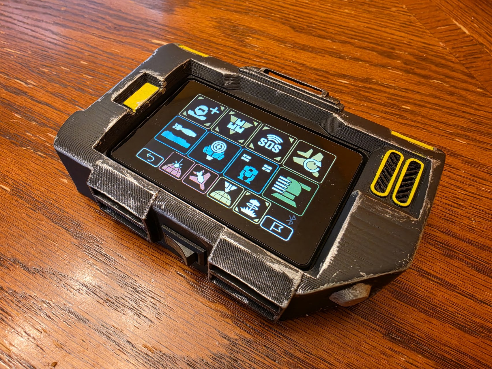

---

## 1. Bill of Materials

Any part links are examples and not a direct recommendation. You may be able to find cheaper sources at local hobby stores, Amazon, etc.

**Electronics**
- **[JC3248W535](https://www.aliexpress.com/item/1005007566332450.html?)** - 3.5" ESP32-S3 QSPI touchscreen (the brains + display).
- **microSD card** - for the audio assets, any size works, the contents are only ~10MB.
- **[2x 3.7V 1100mAh LiPo cells](https://www.aliexpress.com/item/1005004304618610.html?)** (You can use different sizes depending on your goal, so long as it fits in the battery tray!)
- **[TP4056 charging module](https://www.aliexpress.com/item/1005006904523567.html?)** - LiPo charge management. if you can find one that has the CC1 and CC2 pins correctly wired for USB C power negotation, let me know, otherwise the tacpad will only charge from a USB A to USB C cable. You can also use Micro USB if preferred.
- **[0.9-5V To 5V DC-DC Step-Up Boost Converter Board](https://www.aliexpress.com/item/1005003479999072.html?)** - boosts the 3.7V LiPo to a stable 5V
- **[KCD1 Latching power switch](https://www.aliexpress.com/item/32873386670.html?)** - external on/off.
- **[2x 10 kΩ resistors](https://www.aliexpress.com/item/1005007539842999.html?)** - battery-level voltage divider _(optional; see [Battery monitor](README.md#battery-monitor-optional))_.

**Connectors**

I recommend buying a generic 1.25mm JST connector kit + necessary solder/crimping hardware to make disassembly easier. [I'm a big fan of these types of connector sets.](https://www.aliexpress.com/item/1005008691681233.html?) I've specified the bare minimum necessary connectors below. 
- **4P1.25 JST male connector** - used to connect power to the power port on the ESP32
- **2P1.25 JST male connector** - used to connect the speaker to the speaker port on the ESP32
- **8P1.25 JST male connector** - (optional) used to connect the battery-level sense wire to GPIO7 for the battery monitor
- **2x male and female JST connector (any size)** - Used to connect the LiPo batteries to the TP4056 charging module. Use a preferred size (I used 2.5mm connectors for mine)

**Hardware**
- **[4x M3x4x5mm Heat Set Inserts](https://www.aliexpress.com/item/1005006071488810.html?)** - Voron-standard Heat Set inserts, used for screwing the lid to the body
- **4x M3x8 FCHS** - for screwing on the lid to the main body
- **3x Generic Velcro straps** - The tacpad has space for 2 straps on the bottom and 1 on top for affixing to your cosplay/arm/etc
- Hookup wire, solder, **Kapton tape** (insulation).

**Printed parts:** see [Section 2](#2-3d-printed-parts).

---

## 2. 3D printed parts

The shell is based on [Senpaijeffa's Helldivers 2 Tacpad](https://makerworld.com/en/models/997088-helldivers-2-tacpad-with-touchscreen-for-cosplay#profileId-1437063). The STLs for this build live in [`3d-print/`](3d-print/):

- [`3d-print/tacpad-body.stl`](3d-print/tacpad-body.stl) is the main body / enclosure.
- [`3d-print/tacpad-lid.stl`](3d-print/tacpad-lid.stl) is the lid.

### Print Settings
Use your standard print settings for both parts. I recommend at least 2 walls, 15% infill and 4 top/bottom layers.
Supports are required on both parts, but I've taken steps to minimize where they're needed to only the internal structure of the main body, and the LiPo pouch on the lid.

---

## 3. Electronics & wiring

The **wiring diagram below is the source of truth**; the written steps are a walkthrough of it. If anything conflicts, trust the diagram.

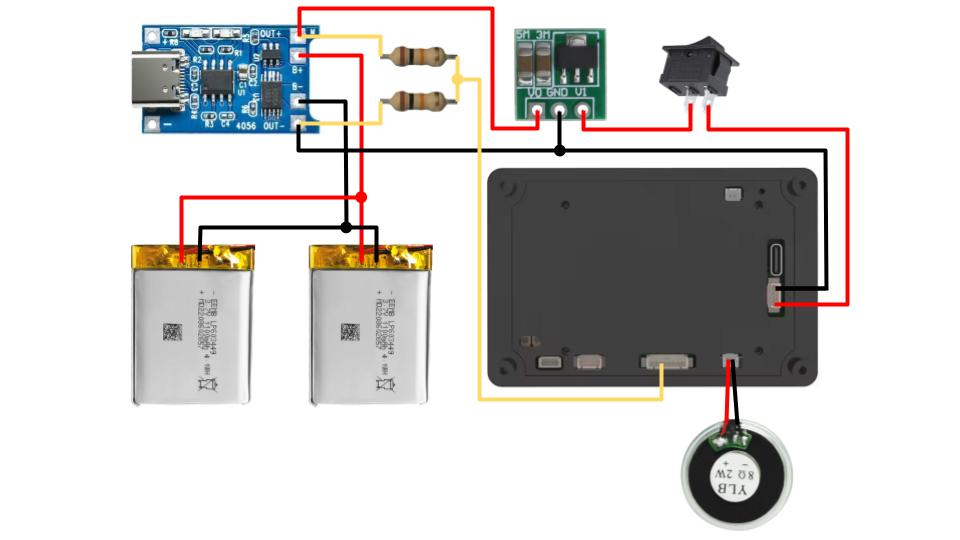

### Power flow at a glance
The system is powered off of 2 3.7V 1100mAh LiPo batteries. These batteries give the unit an estimated runtime of 6-7 hours. These batteries are wired into the TP4056 charging module, allowing the unit to be charged via USB regardless of whether it is switched on or not. Do note that the Display's own USB C port is concealed once the unit is assembled, so you should flash the unit before final assembly.

The TP4056 module is then wired to the DC-DC step up converter to supply stable 5V power to the Display. The power switch is wired next to allow you to switch the unit on and off.

The speaker is wired directly to the speaker port. Be careful to get the polarity correct here.

Lastly, a voltage divider using 2 10K resistors is wired across Out+ and Out-, the in between wire is run to GPIO7 on the Display for the battery monitor.

### 3a. Battery, charging & boost (TP4056 + step-up)
> #### **[WARNING]**
> Make sure both batteries are of a reasonably similar charge before connecting them together. The batteries will balance their voltages once they are wired together, and so a large difference in charge voltages can be hazardous!

Prepare two 2-pin JST connectors for your battery connectors. Wire both in parallel on the TP4056 module's BAT+ and BAT- pads. Mind your polarities here and be careful not to short anything out. Connect the batteries to each plug.

You can now connect a USB cable to the TP4056 module to test charging, and using a multimeter on the OUT+ and OUT- ports to see if power is flowing correctly. 

Next, wire the OUT+ pad to the V0 pad on the DC-DC converter. Wire the OUT- pad to the GND pad on the DC-DC converter. You may find it easier to solder the 2 10K resistors to the OUT+ and OUT- pads now at the same time as the wires, but this is not strictly necessary.

You can now check if the wiring works correctly by using a multimeter to see if the DC-DC converter reads ~5V between its GND and V1 pads. (In my experience this may read closer to 5.4V)

Solder another wire to either the GND pad on the DC-DC converter or to the OUT- pad on the TP4056, and a wire to the V1 pad of the DC-DC converter.

Optionally, wire a 2P1.25mm or 2P2.5mm JST connector to the GND and V1 pads of the DC-DC converter to make it easier to connect and disconnect from the power switch, as seen in the image below:

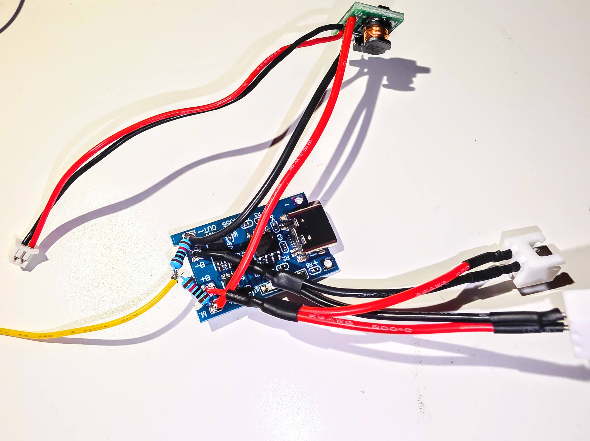

Next, I recommend using some Kapton tape or similar to insulate the converter so that there is no risk of it shorting out against something else.

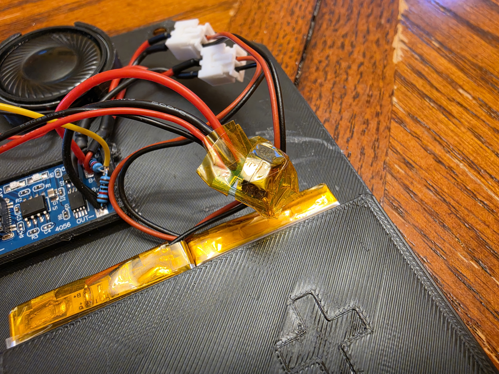

### 3b. Rocker switch and power connector

The V1 pad on the DC-DC converter is your VIN wire, and either the GND or OUT- pad is your GND wire. Wire them to the 4-pin power connector (4P1.25mm connector), with the rocker switch interrupting the VIN wire to allow you to cut power to the display.

Use the image below for reference, and mind the labeling on the Display to ensure your wires are going to the correct pins (the wiring diagram above shows the correct pins)

With the power connector attached to the Display (again, PLEASE check polarity and everything carefully!) you can flip the switch and test if the unit turns on correctly.

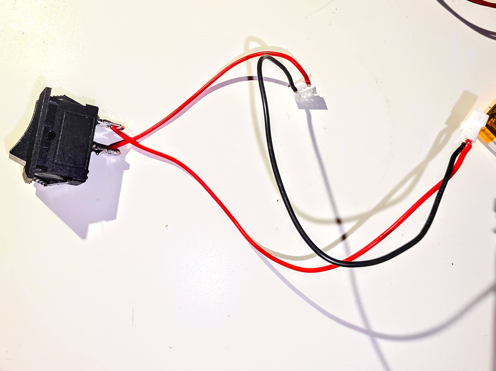

### 3c. Speaker wiring

Wire the speaker to the 2P1.25mm connector, minding the polarity as per the wiring diagram.
The unit should be able to play audio now

### 3d. Battery level monitor (optional)

For the on-screen battery charge display, wire a voltage divider using two 10K resistors. Refer to section 3a for a reference. Your resistors should wire from OUT+, to OUT- with a wire in between. Route this wire to the 3rd pin on the 8P1.25mm connector (verify that you're plugging into GPIO7 on the back of the Display unit)

### 3e. Final wiring

Your connectors going into the display should look like this:

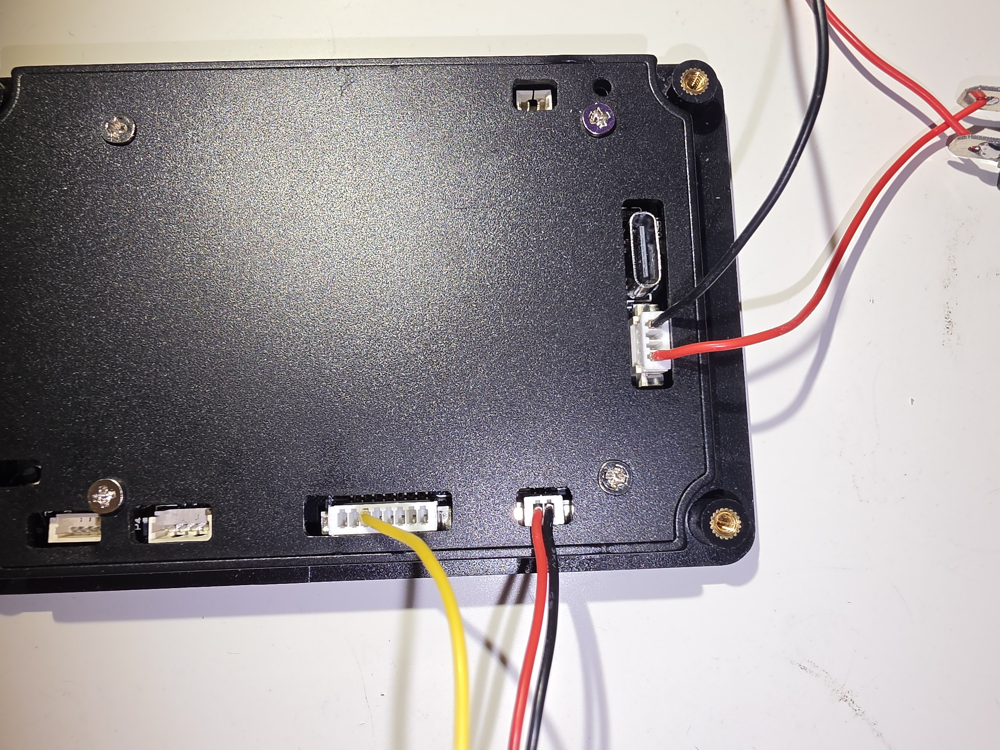

---

## 4. Firmware

> #### **[WARNING]**
> Never have the battery power and USB power going into the display at the same time. This can cause various issues, make sure your unit is switched off before plugging in USB for flashing!

Flash the firmware and copy the audio assets to the SD card. Full steps are in the [README → Build & flash](README.md#build--flash). Ensure everything is working correctly. Sound is playing on the speaker, the display is responsive, and the battery % is reading approximately correct.

If using the battery monitor, you can tune the accuracy of the reading by using a multimeter to measure the OUT+ and OUT- pads with a multimeter, and offsetting the battery voltage in the settings -> misc tab. 

---

## 5. Assembly

> This is a good moment to ensure you've flashed the ESP32 with the Tacpad firmware. Once assembly is complete, the Display's USB C connector will be inaccessible.

With everything wired and tested, you can start installing the various components to the bottom lid. The TP4056 board should cleanly slot into its space (I recommend a dab of glue to lock it into place if it's a bit loose)

Next, slot the speaker into its cutout, ensuring the wires are coming out from the channel, inwards. Fix the speaker using some glue.

Lastly, install the 2 LiPo batteries into the battery slot. I used some double sided adhesive on mine to help keep them from sliding around, as this solution is non-permanent and I can still remove them if needed.

For the main body, first use a soldering iron to install the 4 heatset inserts into the part. Next, use the 4 provided screws to screw the Display into place, minding that the USB C-side of it should sit next to the speaker hole to ensure the screen is correctly oriented (no worries if it's not, you can always invert it in the settings menu!)

Finally, insert the rocker switch into the slot.

> Note that in the below assembly photos the DC-DC converter is lacking Kapton tape, I did this step after taking the photos.

Wire up the entire unit, aiming to get a similar result to the images below:

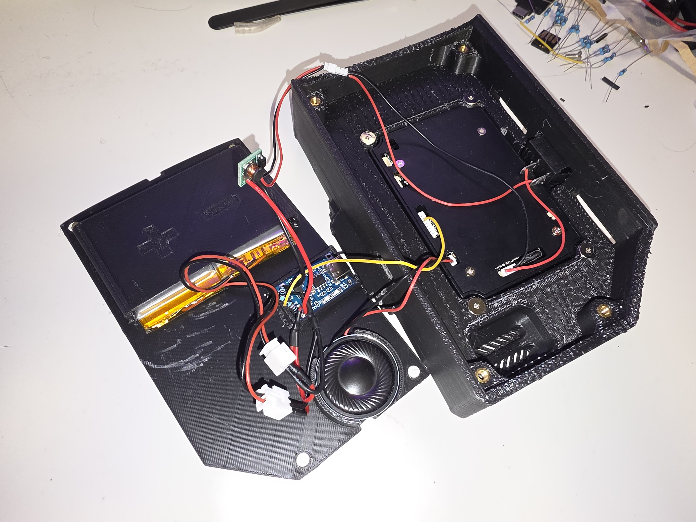
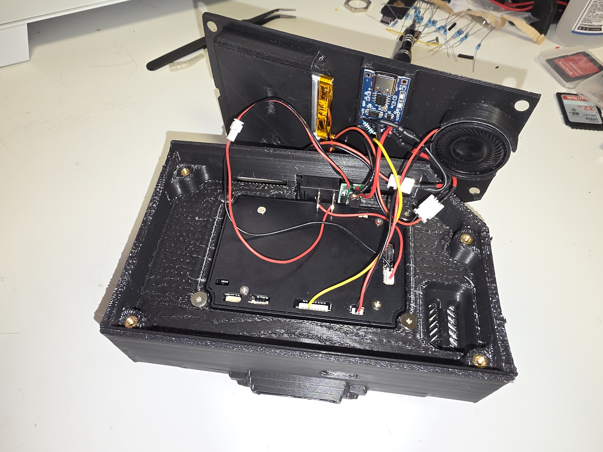

This is a good moment to test everything out and ensure all your electronics are still working.

Once you're happy with everything, carefully tuck the wires and ensure nothing is being pinched or crushed as you fit the lid onto the back of the main body. Ensure the USB charging port is visible in the charging slot.

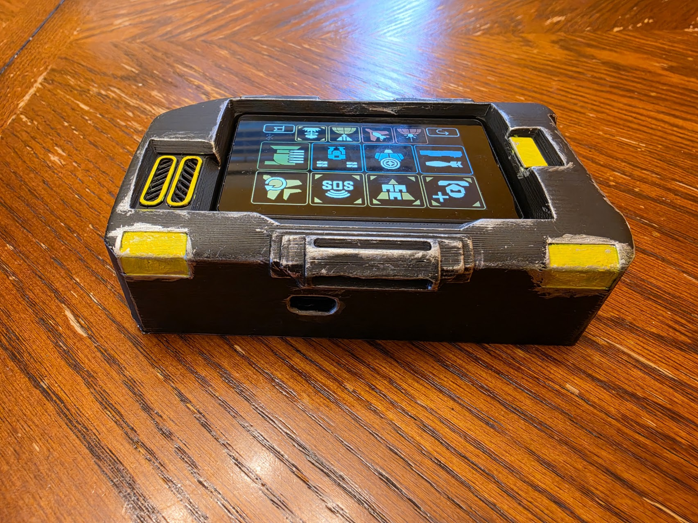

Use the 4 M3x8 FHCS to screw the lid to the main body, again making sure that everything fits together without too much resistance. You don't want to accidentally pinch a wire and fry the whole thing so close to the finish line!

---

## 6. Finished

Congratulations on your newly finished Tacpad Helldiver! I hope it serves you well! You can use the 3 velcro strap points to affix this unit to your cosplay or other places, or leave it as-is as a display piece. 

For charging, if you plug a USB C cable into the back, you should see the inside of the unit glow red as it's charging, and change to blue/green once charged (double check your exact charging module's colour scheme) If the charging port doesn't quite fit a USB cable, you may need to sand it a bit to widen the gap.

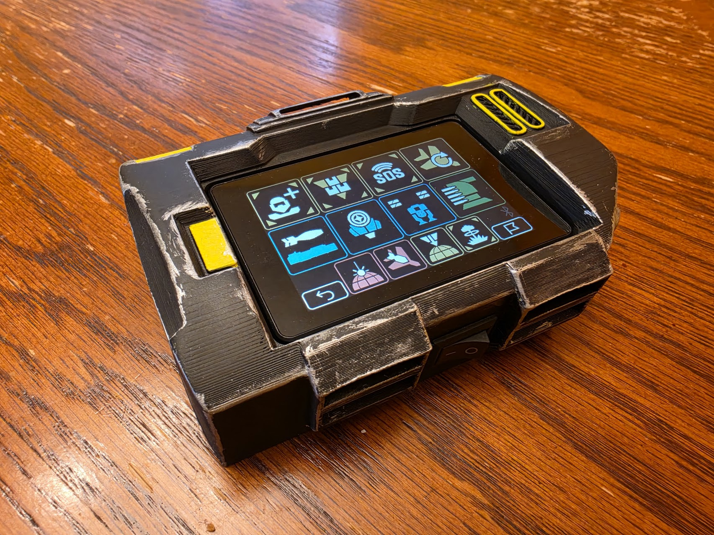
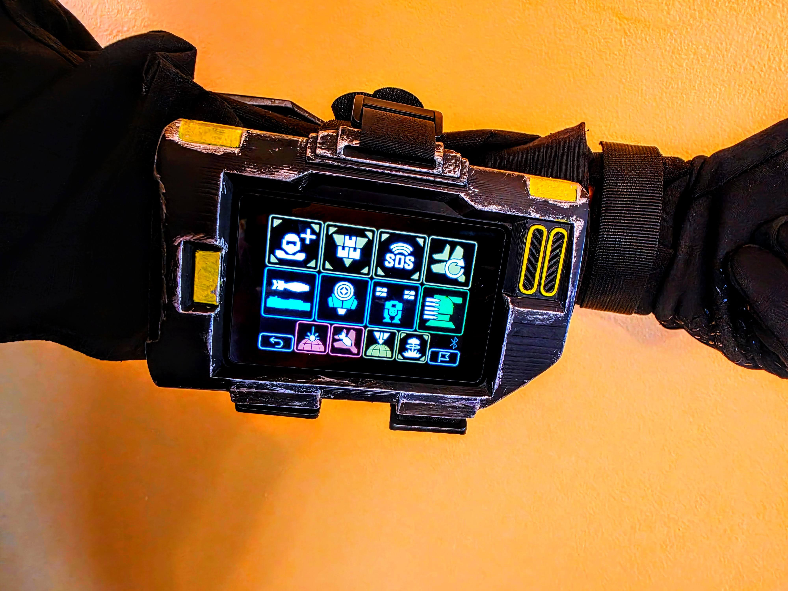

For Super Earth!
