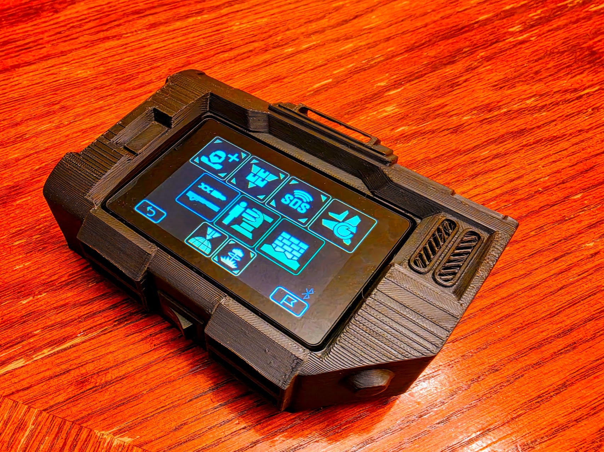

# HD2 Tacpad

> ***"Stratagems primed. For Super Earth. For Managed Democracy."***

A working **HELLDIVERS™ 2 Stratagem Tacpad** — a cosplay prop that's also a real stratagem input device. Punch your codes into the touchscreen and the Tacpad transmits them to your PC as keyboard input, complete with the sound effects, team voice callouts, and a **"REQUEST RECEIVED"** call-in reveal straight off the front lines.

Built on an affordable ESP32-S3 touchscreen and connected over **USB or Bluetooth** as a keyboard, it works as an actual stratagem macropad *and* looks the part strapped to your wrist on the drop.


<!-- TODO: save the hardware photo to screens/tacpad.jpg -->

> [!NOTE]
> This is a **fork** of [unic8s/hd2_macropad](https://github.com/unic8s/hd2_macropad) — see [Lineage & Credits](#lineage--credits) below. It runs on the specific device [JC3248W535](https://s.click.aliexpress.com/e/_DneMCLR) (a 3.5" ESP32-S3 QSPI touchscreen).

---

## Lineage & Credits

This project stands on the shoulders of prior democratic contributions — please support the originals:

- **Firmware base — [unic8s/hd2_macropad](https://github.com/unic8s/hd2_macropad).** All the core stratagem-input, loadout, preset, cooldown, and configuration machinery is theirs. This fork is an immersion + input-feel layer on top. Detailed device setup & configuration lives in their [Wiki](https://github.com/unic8s/hd2_macropad/wiki).
- **Physical Tacpad design — [Senpaijeffa's *Helldivers 2 Tacpad*](https://makerworld.com/en/models/997088-helldivers-2-tacpad-with-touchscreen-for-cosplay#profileId-1437063)** on MakerWorld. The 3D-printed prop this build is based on. *(Custom print files tailored to this build are planned.)*
- **Stratagem icons — [@nvigneux](https://github.com/nvigneux)'s [Helldivers 2 Stratagems SVG set](https://github.com/nvigneux/Helldivers-2-Stratagems-icons-svg).**
- **Device demo/reference — [@NorthernMan54](https://github.com/NorthernMan54)'s [JC3248W535EN project](https://github.com/NorthernMan54/JC3248W535EN).**
- **UI & menu SFX — [Gromlon Props](https://github.com/gromprops/Helldivers-2-Stratagem-Tacpad).** The interface, menu, and stratagem sound effects come from their Helldivers 2 Stratagem Tacpad project.
- **Voice lines —** HELLDIVERS™ 2 in-game audio, from the community clip collection shared on [r/Helldivers](https://www.reddit.com/r/Helldivers/comments/1c348h6/helldivers_2_short_audio_clips_here_for_your/) ([clips folder](https://drive.google.com/drive/folders/1VT6HKNjR-lEG9xjQJB1dwWCI1ufyEFug)).

**HELLDIVERS™ 2** is © Arrowhead Game Studios, published by Sony Interactive Entertainment. This is a non-commercial fan project and is not affiliated with either.

---

## What this fork adds

Everything from the base firmware, plus a full front-line immersion layer:

- 🔊 **Helldivers SFX throughout** — directional arrow tones, stratagem-prime cue, menu open/close, tab swipes. The original macropad sounds are swapped for in-universe audio.
- 📡 **Team voice callouts** — your Super Destroyer and Eagle-1 announce stratagems by category with randomized lines, triggered on the call-in, exactly like in the field.
- 🖥️ **"REQUEST RECEIVED" call-in screen** — a full-screen reveal (icon + name) every time a stratagem is dispatched.
- 🎯 **Manual arm-mode input** — hold the centre d-pad toggle to *open the stratagem menu* (it holds Ctrl on the host), then tap your code on the arrows. Each valid input is sent **live**, so the in-game menu builds as you type; complete a valid code and it throws + auto-disarms.
- ⚡ **Crisp, reliable touch input** — the panel's phantom double-taps are fixed at the source, so codes register cleanly even when spammed fast.
- 🔈 **Volume control** in settings and loudness-normalized audio across every cue and voice line.

Loadout selection, presets, user icons, cooldown tracking, ship-module modifiers, and BLE/USB switching all carry over from the base firmware.

---

## Hardware

- **Device:** [JC3248W535](https://s.click.aliexpress.com/e/_DneMCLR) — 3.5" ESP32-S3 QSPI touchscreen (AXS15231B touch controller).
- **microSD card** — holds the sound + image assets.
- **3D-printed Tacpad shell** — based on [Senpaijeffa's design](https://makerworld.com/en/models/997088-helldivers-2-tacpad-with-touchscreen-for-cosplay#profileId-1437063).

## Build & flash

Built with [PlatformIO](https://platformio.org/) (ESP-IDF / `espressif32`):

```sh
pio run -t upload
```

Then copy the contents of `sdcard/` to the root of a microSD card and insert it into the device. On first boot, pick your connection (USB or Bluetooth) and stratagem keybinding in the settings screen — it defaults to **Ctrl + WASD/arrow keys** to match the game.

> [!TIP]
> For full step-by-step device assembly, wiring, and configuration, follow unic8s's [Wiki](https://github.com/unic8s/hd2_macropad/wiki) — it all applies to this fork.

## Assets (SD card)

- `sdcard/assets/sound/` — WAV sound effects + voice lines (44.1 kHz / 16-bit / mono PCM).
- `sdcard/assets/img/` — stratagem icons.

---

## Get the game

[HELLDIVERS™ 2 on Steam](https://store.steampowered.com/app/553850/HELLDIVERS_2/) · [PlayStation™](https://www.playstation.com/games/helldivers-2/)

## Disclaimer

> This is a private, open-source, non-commercial fan project and is not associated in any way with Sony Interactive Entertainment LLC or Arrowhead Game Studios. HELLDIVERS™ and PlayStation™ are registered trademarks of Sony Interactive Entertainment LLC. Assets in this project are either produced for free non-commercial use or published by the owners credited above.
